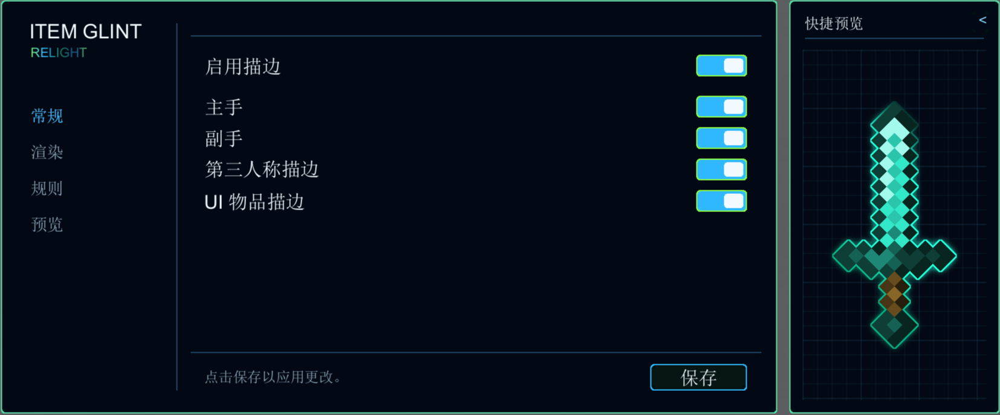
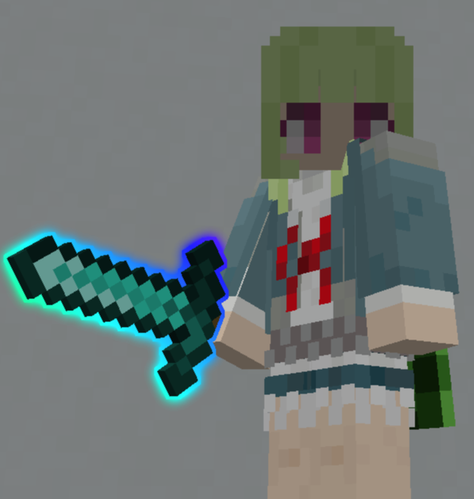
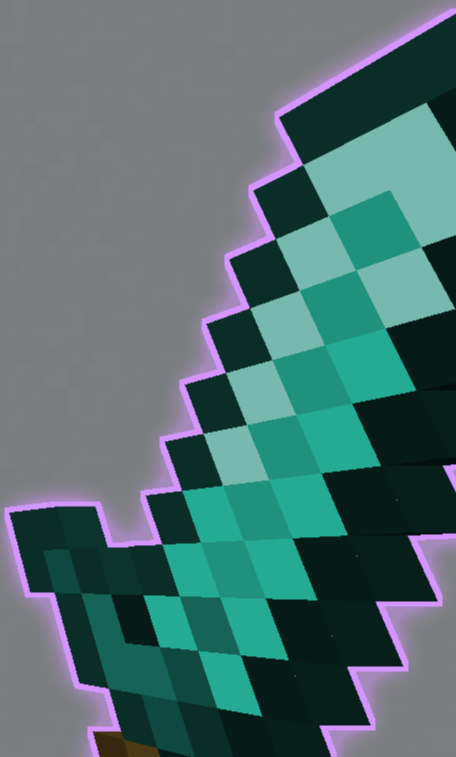
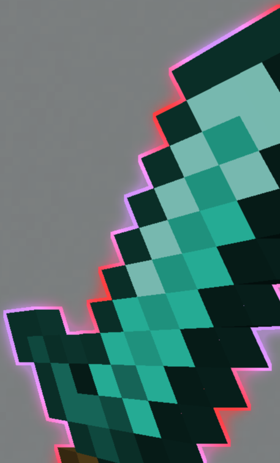
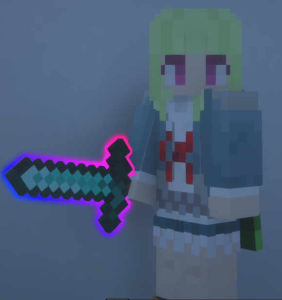
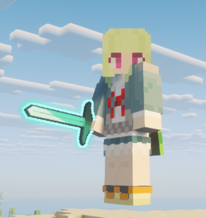
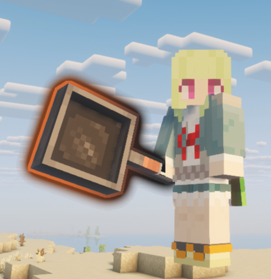
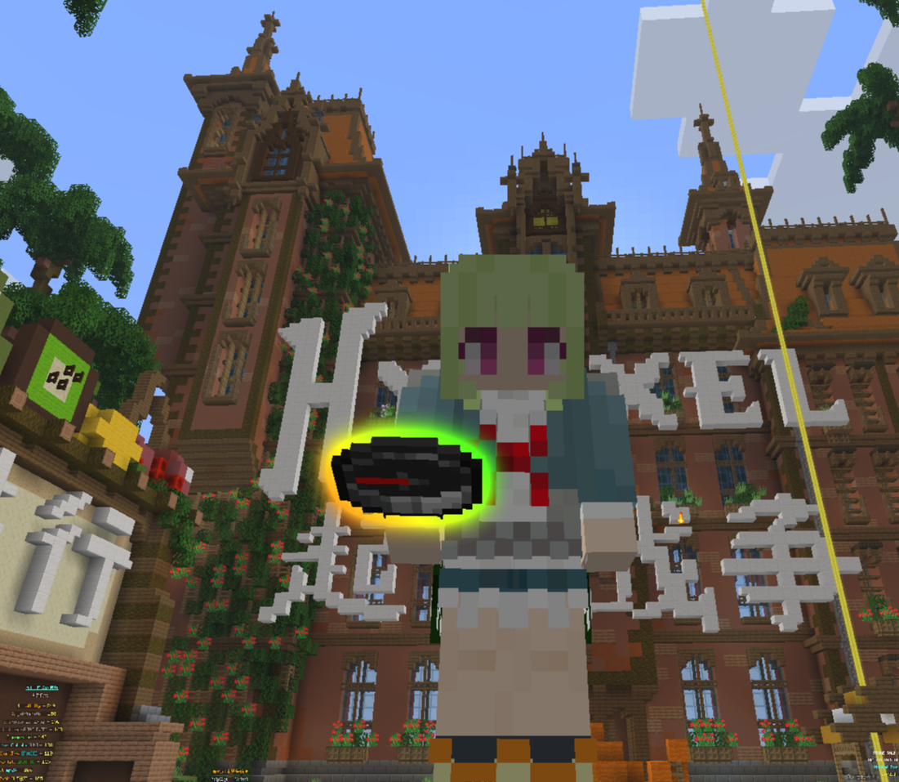

# ItemGlintRelight

ItemGlintRelight 是一个 Fabric 客户端模组，用于重新绘制 Minecraft 中物品的高亮效果。它覆盖手持物品、第三人称物品和 GUI 物品，并提供统一的配置界面。

当前开发目标为 Minecraft 1.21.11，需要 Java 21、Fabric Loader 和 Fabric API。配置界面可通过 Mod Menu 打开。



## 功能

- 可分别启用主手、副手、第三人称和 GUI 物品的效果。
- 支持单色、双色、彩虹和纹理采样等颜色模式，也支持不同的描边形状和质量设置。
- 提供描边宽度、透明度、发光和边缘效果等常用参数。
- 可按物品 ID、标签或 NBT 条件建立规则，并设置规则优先级。
- 第三人称效果包含光影兼容处理；多人游戏中仅在客户端渲染。

第三人称下的描边和泛光会跟随物品模型，而不是跟随屏幕上的固定区域。

<p align="center">
  
</p>

不同颜色模式和描边样式可以组合使用，适合区分物品类别或表达不同状态。

<p align="center">
  
  
</p>

## 兼容性

### 光影

第三人称描边和泛光会使用单独的光影兼容路径，避免与场景深度和物品遮挡发生错误叠加。

<p align="center">
  
</p>

### 材质包

描边根据物品当前渲染出的轮廓生成，不会替换材质包提供的物品贴图。

<p align="center">
  
</p>

### 模组物品

使用常规物品渲染流程的模组物品也会进入描边处理，无需单独为物品注册外观。

<p align="center">
  
</p>

### 多人服务器

模组不向服务端发送描边状态，可在多人游戏中使用。



## 安装与使用

1. 安装 Minecraft 1.21.11 对应的 Fabric Loader 和 Fabric API。
2. 将构建产物中的 `itemglintrelight-fabric-1.21.11-*.jar` 放入游戏实例的 `mods` 目录。
3. 进入游戏后，通过 Mod Menu 打开配置界面，调整开关、描边样式和规则。

## 开发

### 环境

- JDK 21
- Windows、Linux 或 macOS
- 项目自带 Gradle Wrapper；不需要单独安装 Gradle

### 构建与运行

在仓库根目录执行：

```powershell
# 编译并打包 1.21.11 版本
.\gradlew.bat :versions:1.21.11:build

# 启动开发客户端
.\gradlew.bat :versions:1.21.11:runClient
```

构建后的 jar 位于 `versions/1.21.11/build/libs/`。只检查客户端源码时，可以执行：

```powershell
.\gradlew.bat :versions:1.21.11:compileClientJava
```

### 项目结构

```text
common/
  src/main/       配置、规则、通用入口与资源
  src/client/     配置 UI、客户端初始化与通用 UI 组件
versions/
  1.21.11/        1.21.11 专属渲染、Mixin 和 Gradle 子项目
gallery/          README 使用的截图
docs/             多版本维护说明
```

版本无关代码放在 `common/`。Minecraft 渲染接口、Mixin 和兼容代码保留在对应的 `versions/<版本>/` 子项目中。新增版本时，请参照 [docs/MULTI_VERSION.md](docs/MULTI_VERSION.md)。

## 许可

本项目使用 [MIT License](LICENSE)。
